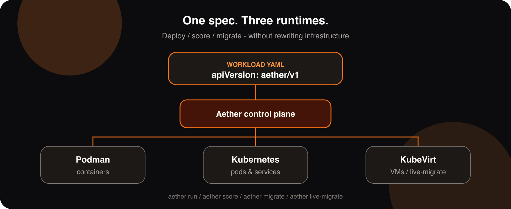
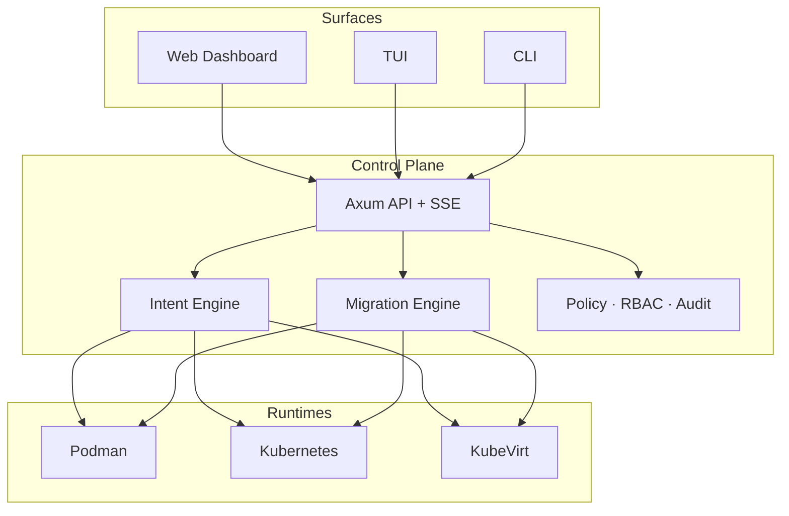

<div align="center">


# Aether

### One YAML. Three runtimes. Zero lock-in.

The universal runtime control plane — deploy the same workload to **Podman**, **Kubernetes**, and **KubeVirt**, then migrate between them without rewriting infrastructure.

[Releases](https://github.com/zyvorai/Aether/releases) · [Quick Start](#quick-start) · [User Guide](docs/user-guide/aether-user-guide.md) · [Docs](docs/README.md)

[](LICENSE)
[](https://github.com/zyvorai/Aether/releases)
[](https://github.com/zyvorai/Aether/actions/workflows/ci.yml)
[](Cargo.toml)

<br/>



</div>

---

## Why Aether

Most teams write the app once — then rewrite the **deploy story** three times.

<table>
<tr>
<td width="33%" valign="top">

### Intent engine

Declare what you care about — cost, performance, reliability. Aether **scores** Podman / Kubernetes / KubeVirt and recommends (or selects) the lane.

</td>
<td width="33%" valign="top">

### Nine migration paths

Every runtime pair. Immediate, blue-green, or rolling. KubeVirt **live migration** with vGPU-aware validation.

</td>
<td width="33%" valign="top">

### One brain, many surfaces

CLI, TUI, glass web dashboard, and REST + SSE API — same control plane, same state.

</td>
</tr>
</table>

> Aether is Terraform for *where* workloads run — not just *what* they are.

---

## Quick Start

### Install a release binary

```bash
# macOS Apple Silicon
curl -LO https://github.com/zyvorai/Aether/releases/download/v0.4.0/aether-macos-arm64
chmod +x aether-macos-arm64 && sudo mv aether-macos-arm64 /usr/local/bin/aether

# Linux amd64
curl -LO https://github.com/zyvorai/Aether/releases/download/v0.4.0/aether-linux-amd64
chmod +x aether-linux-amd64 && sudo mv aether-linux-amd64 /usr/local/bin/aether

aether --help
```

Also available: **macOS amd64** (`aether-macos-amd64`) and `.sha256` checksums on the [Releases](https://github.com/zyvorai/Aether/releases) page.

### Run from GHCR (container)

Official images publish from the Release workflow to GitHub Container Registry:

```bash
# Pull
docker pull ghcr.io/zyvorai/aether:0.4.0
# or: docker pull ghcr.io/zyvorai/aether:latest

# CLI via container (mount state + kubeconfig)
docker run --rm -it \
  -v "$HOME/.aether:/root/.aether" \
  -v "$HOME/.kube:/root/.kube:ro" \
  -v "$(pwd):/work" -w /work \
  ghcr.io/zyvorai/aether:0.4.0 --help

# API + glass dashboard on :5090
docker run --rm -p 5090:5090 \
  -v "$HOME/.aether:/root/.aether" \
  ghcr.io/zyvorai/aether:0.4.0 serve --host 0.0.0.0 --port 5090
```

Tags: `latest`, `0.4.0`, `0.4`, `0` — image: [`ghcr.io/zyvorai/aether`](https://github.com/zyvorai/Aether/pkgs/container/aether).

### Run a workload

```bash
aether init
aether run --spec examples/demo-webserver.yaml
aether list --output wide

# Glass dashboard + API
aether serve
# → http://localhost:5090
```

<details>
<summary><b>Build from source</b></summary>

```bash
git clone https://github.com/zyvorai/Aether.git && cd Aether
(cd web/dashboard && npm ci && npm run build)   # embedded UI assets
cargo build --release
./target/release/aether --help
```

</details>

### The entire contract

```yaml
apiVersion: aether/v1
kind: Workload
metadata:
  name: demo-webserver
requirements:
  cpu: "500m"
  memory: 256Mi
runtime:
  preferred: kube
  allow: [kube, podman, kubevirt]
network:
  service: true
  ports:
    - containerPort: 8080
      servicePort: 80
```

One file. Three possible homes. Aether decides — or you override.

---

## Migration matrix

| From → To | Podman | Kubernetes | KubeVirt |
|-----------|:------:|:----------:|:--------:|
| **Podman** | — | Yes | Yes |
| **Kubernetes** | Yes | — | Yes |
| **KubeVirt** | Yes | Yes | Yes · live-migrate |

```bash
# Blue-green across runtimes
aether migrate my-app --from kube --to kubevirt --strategy blue-green

# Node-to-node KubeVirt live migration
aether live-migrate my-vm --watch-timeout 120

# Intent re-score
aether score --spec workload.yaml
```

Strategies: `immediate` · `blue-green` · `rolling` — with drain, health gates, and rollback paths.

---

## Glass dashboard

Zyvor-orange accent on macOS-26-style glass — not another Bootstrap admin theme.

- **SSE** live updates after mutations
- **Command palette** — `⌘K` / `Ctrl+K`
- **Workload detail** — Overview · Logs · Drift · Scoring
- **Discovered pods & VMs** — Logs + Shell (Operator / Admin)
- **Intent debugger** — SVG radar for cost / performance / reliability / availability

```bash
aether serve          # → http://localhost:5090
# or: cd web/dashboard && npm run dev
```

Demo login (local): `admin` / `Admin@321`

---

## Architecture



| Path | Purpose |
|------|---------|
| `src/` | Control plane — CLI, API, adapters, intelligence |
| `web/dashboard/` | React 18 + TypeScript + Tailwind glass UI |
| `examples/` | Specs you can run today |
| `helm/` · `packaging/` | Cluster & OS packaging |
| `docs/` | Guides, architecture, user manuals |

| Interface | How |
|-----------|-----|
| CLI | `aether run` · `migrate` · `serve` · `live-migrate` · … |
| API | `http://localhost:5090/api/*` |
| TUI | `aether ui` |
| Web | `aether serve` → browser |

---

## Documentation

| Want… | Go here |
|-------|---------|
| Full feature map | [User Guide](docs/user-guide/aether-user-guide.md) · [PDF](docs/user-guide/aether-user-guide.pdf) |
| Install / 5-minute start | [Installation](docs/getting-started/01-Installation.md) · [Quick Start](docs/getting-started/02-Quick-Start.md) |
| Migration internals | [MIGRATION-INTERNALS](docs/guides/migration/MIGRATION-INTERNALS.md) |
| Scoring / intent | [Decision engine](docs/guides/decision-engine/SCORING.md) |
| Docs index | [docs/README.md](docs/README.md) |
| Contributing | [CONTRIBUTING.md](CONTRIBUTING.md) |

Part of the [Zyvor](https://zyvor.dev) private-cloud stack — Aether is the universal runtime portability plane.

---

## Development

```bash
make ci          # tests + clippy + dashboard build + vitest
cargo test
cargo clippy --all-targets --all-features
cd web/dashboard && npm run test && npm run check:hex-surfaces
```

Conventional Commits (`feat:`, `fix:`, `docs:`). PRs welcome — see [CONTRIBUTING.md](CONTRIBUTING.md).

---

## License

**Apache License 2.0** — see [LICENSE](LICENSE).

Confidential computing (**Ragnarok**) is a separate Zyvor product and is **not** shipped in this repository.

---

<div align="center">

### Stop rewriting deploys. Start moving runtimes.

**[Star Aether](https://github.com/zyvorai/Aether)** · **[Releases](https://github.com/zyvorai/Aether/releases)** · **[zyvor.dev](https://zyvor.dev)**

<sub>Built with Rust · Glass · Intent · by ZyvorAI Labs</sub>

</div>
