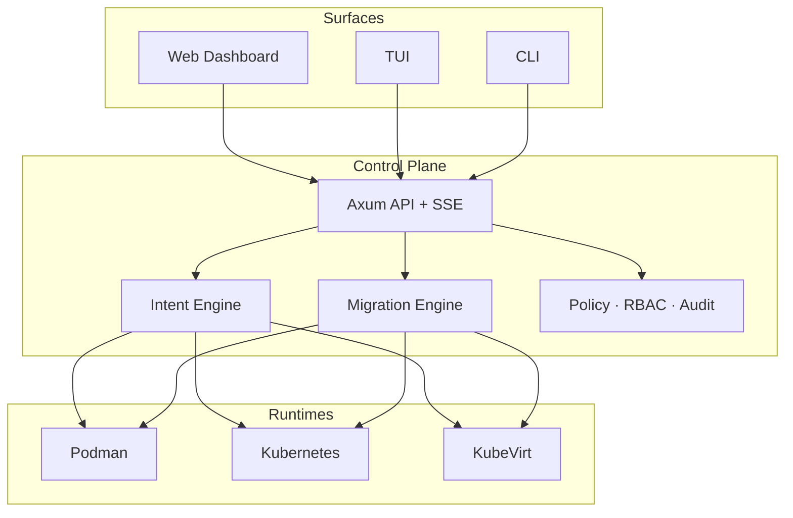

<div align="center">

```text
     █████╗ ███████╗████████╗██╗  ██╗███████╗██████╗
    ██╔══██╗██╔════╝╚══██╔══╝██║  ██║██╔════╝██╔══██╗
    ███████║█████╗     ██║   ███████║█████╗  ██████╔╝
    ██╔══██║██╔══╝     ██║   ██╔══██║██╔══╝  ██╔══██╗
    ██║  ██║███████╗   ██║   ██║  ██║███████╗██║  ██║
    ╚═╝  ╚═╝╚══════╝   ╚═╝   ╚═╝  ╚═╝╚══════╝╚═╝  ╚═╝
```

# One YAML. Three runtimes. Zero lock-in.

**Aether** is the universal runtime control plane — deploy the same workload to
**Podman**, **Kubernetes**, and **KubeVirt**, then migrate between them like
changing lanes on a highway.

[](LICENSE)
[](https://github.com/zyvorai/Aether/releases)
[](Cargo.toml)
[](https://github.com/zyvorai/Aether/stargazers)

[Quick Start](#-quick-start) · [Why it hits different](#-why-it-hits-different) · [Migration matrix](#-migration-matrix) · [Dashboard](#-glass-dashboard) · [Docs](#-documentation) · [Contributing](#-contributing)

<br/>

```text
 ┌──────────────┐   ┌──────────────┐   ┌──────────────┐
 │   Podman     │   │  Kubernetes  │   │   KubeVirt   │
 │  containers  │◄─►│     pods     │◄─►│     VMs      │
 └──────▲───────┘   └──────▲───────┘   └──────▲───────┘
        │                  │                  │
        └────────────┬─────┴─────┬────────────┘
                     │  AETHER   │
                     │ one spec  │
                     └───────────┘
```

</div>

---

## ⚡ What if infrastructure stopped arguing?

Most teams write the app once… then rewrite the **deploy story** three times.

| Reality today | With Aether |
|---------------|-------------|
| Helm chart for K8s, Compose for Podman, YAML hell for VMs | **One** `Workload` YAML |
| Migrations = weekends + prayer | Blue-green / rolling / live-migrate |
| “Which runtime?” = tribal knowledge | Intent engine scores cost · latency · reliability |
| Drift discovered in postmortems | Continuous drift + reconciliation |
| CLI *or* UI *or* GitOps | CLI + TUI + glass web UI + API — same brain |

> **Aether is Terraform for *where* workloads run — not just *what* they are.**

---

## 🔥 Why it hits different

<table>
<tr>
<td width="33%">

### 🧠 Intent engine
Tell Aether what you care about — cost, performance, reliability. It **scores** Podman / K8s / KubeVirt and picks (or recommends) the lane.

</td>
<td width="33%">

### 🔁 Nine migration paths
Every runtime pair. Immediate. Blue-green. Rolling. KubeVirt **live migration** with vGPU-aware rules.

</td>
<td width="33%">

### 🪟 Glass ops UI
macOS-glass dashboard, SSE live updates, `⌘K` command palette, logs + shell into discovered pods & VMs.

</td>
</tr>
<tr>
<td>

### 🛡️ Policy-grade
RBAC (Admin / Operator / Viewer), NetworkPolicy generation, audit trail, secrets with AES-256-GCM.

</td>
<td>

### 🧬 GitOps-native
Reconcile from git. Helm charts. Drift detection that doesn’t ghost you.

</td>
<td>

### ⚙️ Built in Rust
One binary. Fast. Embeds the dashboard. Ships CLI + API + TUI together.

</td>
</tr>
</table>

---

## 🚀 Quick Start

```bash
# Clone the universe
git clone https://github.com/zyvorai/Aether.git && cd Aether

# Dashboard assets (embedded into the binary)
(cd web/dashboard && npm ci && npm run build)

# Forge the binary
cargo build --release

# Boot
./target/release/aether init
./target/release/aether run --spec examples/demo-webserver.yaml
./target/release/aether list --output wide

# Open the glass cockpit
./target/release/aether serve
# → http://localhost:5090
```

<details>
<summary><b>Or grab a release binary</b></summary>

```bash
# macOS Apple Silicon example
curl -LO https://github.com/zyvorai/Aether/releases/download/v0.4.0/aether-macos-arm64
chmod +x aether-macos-arm64
./aether-macos-arm64 --help
```

See all assets on the [Releases](https://github.com/zyvorai/Aether/releases) page.

</details>

### The entire contract

```yaml
apiVersion: aether/v1
kind: Workload
metadata:
  name: demo-webserver
requirements:
  cpu: "500m"
  memory: 256Mi
runtime:
  preferred: kube
  allow: [kube, podman, kubevirt]
network:
  service: true
  ports:
    - containerPort: 8080
      servicePort: 80
```

One file. Three possible homes. Aether decides — or you override.

---

## 🧭 Migration matrix

Move workloads like files — except these files are **running systems**.

| From → To | Podman | Kubernetes | KubeVirt |
|-----------|:------:|:----------:|:--------:|
| **Podman** | — | ✅ | ✅ |
| **Kubernetes** | ✅ | — | ✅ |
| **KubeVirt** | ✅ | ✅ | ✅ live-migrate |

```bash
# Blue-green across runtimes
aether migrate my-app --from kube --to kubevirt --strategy blue-green

# Node-to-node KubeVirt live migration
aether live-migrate my-vm --watch-timeout 120

# Let intent re-score placement
aether score --spec workload.yaml
```

Strategies: `immediate` · `blue-green` · `rolling` — with drain, health gates, and rollback paths.

---

## 🪟 Glass dashboard

Not another Bootstrap admin theme.

- **Zyvor orange** accent on macOS-26-style glass
- **SSE** — mutations land in the UI without refresh spam
- **Command palette** — `⌘K` / `Ctrl+K`
- **Workload detail** — Overview · Logs · Drift · Scoring
- **Discovered pods & VMs** — Logs + Shell (Operator/Admin)
- **Intent debugger** — SVG radar for cost / performance / reliability / availability

```bash
cd web/dashboard && npm run dev
# or: aether serve  →  :5090
```

Demo login (local): `admin` / `Admin@321`

---

## 🏗 Architecture

```text
┌─────────────────────────────────────────────────────────────────┐
│  SURFACES                                                        │
│  React Web UI  ·  ratatui TUI  ·  Rust CLI  ·  REST + SSE API    │
├─────────────────────────────────────────────────────────────────┤
│  BRAIN                                                           │
│  Intent scoring  ·  Migration engine  ·  Policy / RBAC / Audit   │
│  Drift · GitOps reconcile · Secrets · Health loop · Copilot/Zyra │
├─────────────────────────────────────────────────────────────────┤
│  ADAPTERS                                                        │
│  Podman  ·  Docker  ·  Kubernetes  ·  KubeVirt                   │
└─────────────────────────────────────────────────────────────────┘
```



---

## 📦 What's in the box

| Path | Purpose |
|------|---------|
| `src/` | Control plane — CLI, API, adapters, intelligence |
| `web/dashboard/` | React 18 + TypeScript + Tailwind glass UI |
| `examples/` | Specs you can run today |
| `helm/` · `packaging/` | Cluster & OS packaging |
| `docs/` | Architecture, guides, customer manuals |

| Interface | How |
|-----------|-----|
| CLI | `aether run\|migrate\|serve\|live-migrate\|…` |
| API | `http://localhost:5090/api/*` |
| TUI | `aether ui` |
| Web | `aether serve` → browser |

---

## 📚 Documentation

| Want… | Go here |
|-------|---------|
| Full feature map (70 features) | [User Guide](docs/aether-user-guide.md) · [PDF](docs/aether-user-guide.pdf) |
| Install / 5-minute start | [Installation](docs/getting-started/01-Installation.md) · [Quick Start](docs/getting-started/02-Quick-Start.md) |
| Migration internals | [MIGRATION-INTERNALS](docs/guides/migration/MIGRATION-INTERNALS.md) |
| Scoring / intent | [Decision engine](docs/guides/decision-engine/SCORING.md) |
| Docs index | [docs/README.md](docs/README.md) |
| Contributing | [CONTRIBUTING.md](CONTRIBUTING.md) |

---

## 🌌 Zyvor constellation

Aether sits in a wider private-cloud stack from [Zyvor](https://zyvor.dev):

| Product | Role |
|---------|------|
| **Aether** | Universal runtime portability ← *you are here* |
| **Ragnarok** | Confidential computing (separate product) |
| **hyper2kvm / HyperSDK** | Multi-cloud VM migration |
| **GuestKit** | Offline guest inspection |
| **PacketWolf** | Network intelligence |
| **Haven** | Identity plane |
| **Fabric / Fleet / Forge** | Private cloud · edge · GPU fabric |

---

## 🛠 Development

```bash
make ci          # tests + clippy + dashboard build + vitest
cargo test
cargo clippy --all-targets --all-features
cd web/dashboard && npm run test && npm run check:hex-surfaces
```

We use Conventional Commits (`feat:`, `fix:`, `docs:`). PRs welcome — see [CONTRIBUTING.md](CONTRIBUTING.md).

---

## 📄 License

**Apache License 2.0** — see [LICENSE](LICENSE).

Confidential computing (**Ragnarok**) is a separate Zyvor product and is **not** shipped in this repository.

---

<div align="center">

### Stop rewriting deploys. Start moving runtimes.

**[★ Star Aether](https://github.com/zyvorai/Aether)** · **[Cut a release](https://github.com/zyvorai/Aether/releases)** · **[zyvor.dev](https://zyvor.dev)**

```text
        one spec  →  any runtime  →  migrate without fear
```

<sub>Built with Rust · Glass · Intent · by ZyvorAI Labs</sub>

</div>
