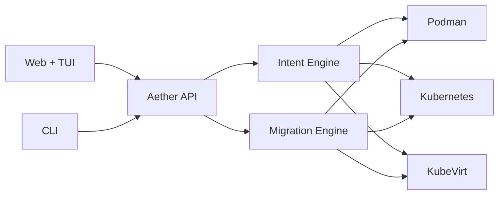

# Aether

**Universal runtime portability.**


## 📖 Feature Guide

**[Aether — Customer Feature Guide](docs/aether-customer-feature-guide.md)** — a complete, customer-facing reference covering all **70 features** across **10 areas**, grounded in the product's actual capabilities. Also available as a print-ready **[PDF](docs/aether-customer-feature-guide.pdf)**.

**[Customer manual (page-by-page)](docs/customer/README.md)** — getting started, admin basics, and a guide for every product surface (PDFs under `docs/customer/pdf/`).

Deploy once. Move workloads across **Podman, Kubernetes, and KubeVirt** without rewriting infrastructure. One YAML spec. Nine migration paths. Production-grade drift detection and intent-driven runtime scoring.

```text
┌──────────────────────────────────────────────────────────────┐
│  Clients     React Web UI · Interactive TUI · Rust CLI       │
├──────────────────────────────────────────────────────────────┤
│  Control     Intent Engine · Migration Engine · Policy Gate  │
├──────────────────────────────────────────────────────────────┤
│  Runtimes    Podman · Kubernetes · KubeVirt                  │
└──────────────────────────────────────────────────────────────┘
```

---

## Why Aether

| Problem | Aether answer |
|---------|---------------|
| Same app, three different deploy paths | One YAML spec validates and deploys everywhere |
| Runtime migrations are manual and risky | 9 runtime pairs with blue-green, rolling, rollback |
| Teams guess which runtime fits | Intent engine scores cost, latency, reliability |
| Config drift goes unnoticed | Drift detection + auto-reconciliation loop |
| Ops needs one pane of glass | k9s-level web UI with SSE, command palette, log viewer |

**Analogy:** Terraform for *where* workloads run — not just *what* they are.

---

## Platform at a Glance

| Layer | What's in the repo |
|-------|-------------------|
| **Core** | Rust runtime control plane — `src/` |
| **Runtimes** | Podman, K8s, KubeVirt adapters |
| **Migration** | Immediate, blue-green, rolling — 9 combinations; KubeVirt live migration (vGPU-aware) |
| **UI** | React dashboard (40+ pages) + interactive TUI — `web/` |
| **Deploy** | Helm, Docker, deb/rpm packages — `helm/`, `packaging/` |
| **Examples** | Compose stacks, demos, migration scenarios — `examples/` |

---

## Quick Start

```bash
git clone https://github.com/ssahani/Aether.git && cd Aether

# Build the dashboard bundle the binary embeds (build.rs falls back to a stub if skipped)
(cd web/dashboard && npm ci && npm run build)

cargo build --release

# First-time setup
./target/release/aether init

# Deploy a workload
./target/release/aether run --spec examples/demo-webserver.yaml

# List across all runtimes
./target/release/aether list --output wide

# Web dashboard
./target/release/aether serve
# → http://localhost:5090
```

| Scenario | Path |
|----------|------|
| Install from packages | [Installation](docs/getting-started/01-Installation.md) |
| 5-minute walkthrough | [Quick start](docs/getting-started/02-Quick-Start.md) |
| Migration internals | [Migration guide](docs/guides/migration/MIGRATION-INTERNALS.md) |
| Intent scoring | [Decision engine](docs/guides/decision-engine/SCORING.md) |

---

## Core Interfaces

### Web UI

SSE real-time updates, command palette (`⌘K`), intent debugger with radar chart, log viewer with follow mode. Discovered Kubernetes pods and KubeVirt VMs expose logs and an in-browser shell (the shell resolves the backing pod, e.g. `virt-launcher-*` for VMs, and requires an Operator or Admin key).

```bash
cd web && npm install && npm run dev
```

### CLI

```bash
aether run --spec workload.yaml --runtime kubevirt
aether migrate my-app --from kube --to kubevirt --strategy blue-green
aether live-migrate my-vm            # KubeVirt node-to-node live migration
aether policy-check --policy production
aether orchestrate watch --interval 30
```

---

## Architecture



Full design: **[Architecture docs](docs/architecture/)** · **[Product overview](docs/PRODUCT.md)**

---

## Documentation

| Goal | Document |
|------|----------|
| Start here | [Docs index](docs/README.md) |
| User journeys | [User stories](docs/USER_STORIES.md) |
| Ecosystem position | [ECOSYSTEM.md](docs/ECOSYSTEM.md) |
| Full page index | [index.md](docs/index.md) |

## Zyvor Platform Stack

| Product | Role |
|---------|------|
| **hypercluster** | Bare-metal Kubernetes bootstrap |
| **machina** | Physical hypervisor OS (libvirt/KVM) |
| **zeus-os** | Cloud / KubeVirt control plane |
| **hermes** | Application layer for Kubernetes |
| **forge** | AI infrastructure on Kubernetes |
| **hypersdk / hyper2kvm** | Multi-cloud VM migration |
| **guestkit** | Offline VM migration assurance |
| **packetwolf** | Kernel-native network intelligence |
| **Aether** | Universal runtime portability |
| **Veyron** | KubeVirt VM command center |
| **IronWolf** | Metal3 bare-metal automation |
| **zyvor-fabric** | systemd-native private cloud |

→ [zyvor.dev](https://zyvor.dev)

---

## Development

See project docs for CI, testing, and contribution guidelines. Historical build summaries in the repo root are snapshots — **`docs/` and this README are authoritative.**

---

## License

See [LICENSE](LICENSE) or project-specific licensing files in `docs/legal/`.
