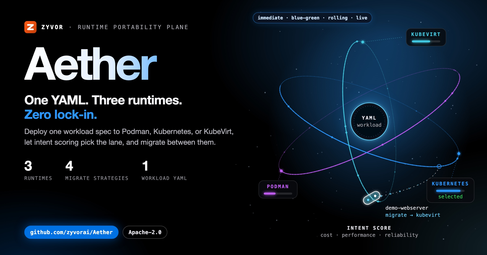
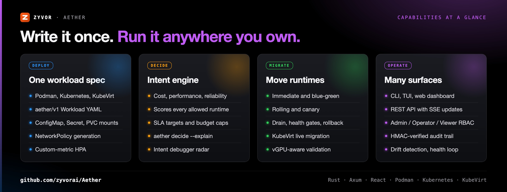
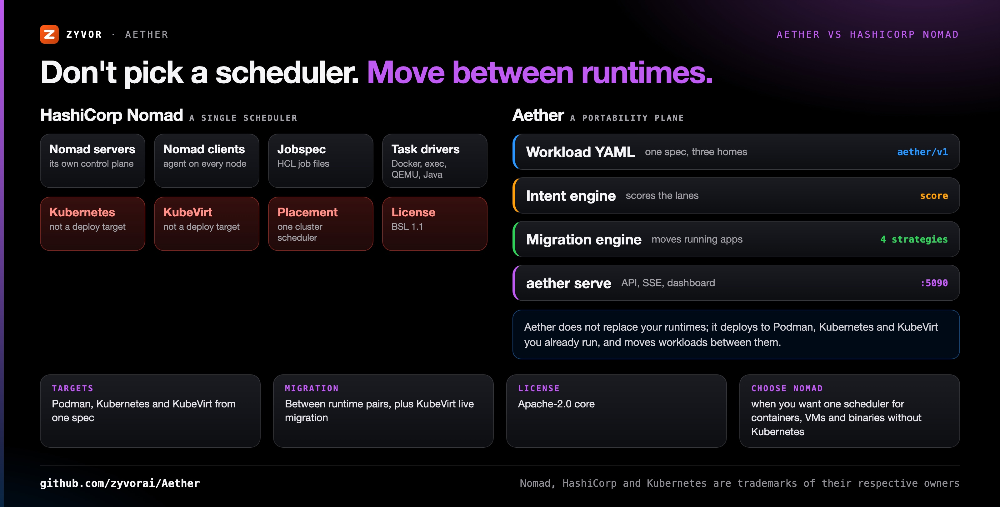
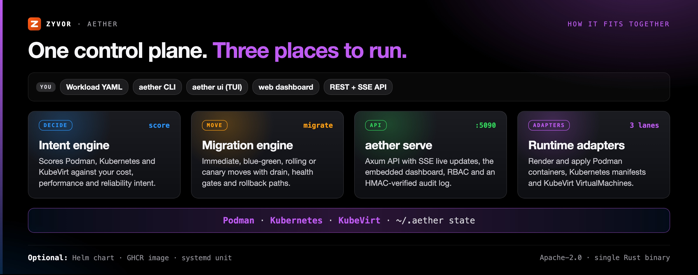
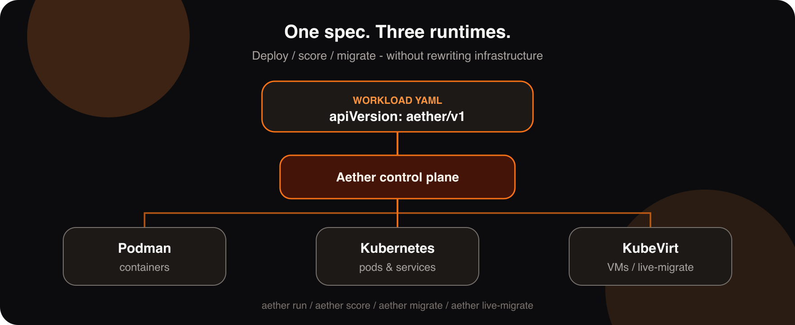
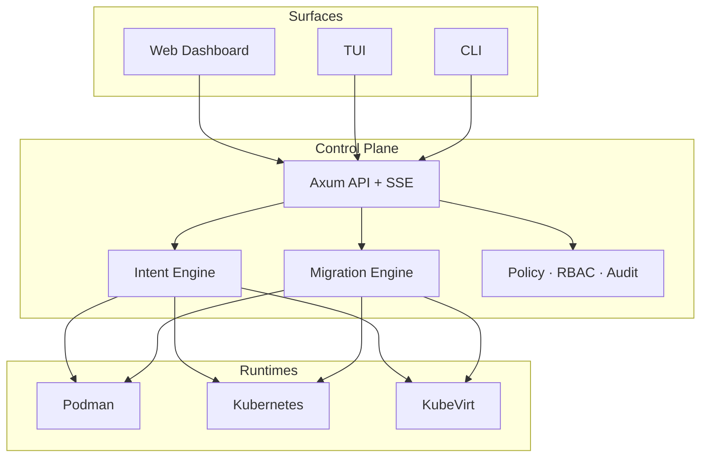

<div align="center">


# Aether

[](LICENSE)
[](https://github.com/zyvorai/Aether/releases)
[](https://github.com/zyvorai/Aether/actions/workflows/ci.yml)
[](Cargo.toml)

[](https://zyvor.dev/schedule?utm_source=github&utm_medium=aether&utm_campaign=readme_hero)
[](https://zyvor.dev/poc?utm_source=github&utm_medium=aether&utm_campaign=readme_hero)
[](#quickstart)



### One YAML. Three runtimes. Zero lock-in.

**The universal runtime control plane: deploy the same workload to Podman, Kubernetes and KubeVirt, then migrate between them without rewriting infrastructure.** Declare what you care about (cost, performance, reliability), let the intent engine score the lanes, and move running workloads with immediate, blue-green, rolling or canary strategies.

**3 runtimes, 1 workload YAML** · **4 migration strategies** · **KubeVirt live migration** · **CLI · TUI · web · REST + SSE** · **Apache-2.0, Rust**

[Releases](https://github.com/zyvorai/Aether/releases) · [User Guide](docs/user-guide/aether-user-guide.md) · [Docs](docs/README.md)

</div>

---

## What's new in 0.4.0

| | |
|---|---|
| **Apache-2.0 open source** | Aether-core is fully Apache-2.0; confidential computing (Ragnarok) moved to a separate product |
| **KubeVirt live migration** | `kubevirt.liveMigration` renders `evictionStrategy: LiveMigrate`; `aether live-migrate <name>` creates a `VirtualMachineInstanceMigration` and watches it |
| **KubeVirt vGPU** | `requirements.gpu.vgpuProfile` attaches mediated vGPU slices instead of VFIO passthrough |
| **Logs and Shell for discovered pods and VMs** | Pods, Deployments, StatefulSets, DaemonSets, VirtualMachines and VMIs, gated to Operator / Admin |
| **RBAC API** | Admin / Operator / Viewer roles enforced in middleware, with key create / list / revoke endpoints |
| **NetworkPolicy and custom-metric HPA** | Generated from the workload spec |

Full list: [CHANGELOG.md](CHANGELOG.md).

---

## Why Aether

Most teams write the app once, then rewrite the **deploy story** three times.

| When this happens… | Aether gives you… |
|---|---|
| The same app needs a Podman host, a Kubernetes cluster and a KubeVirt VM | One `aether/v1` Workload YAML with `runtime.allow: [kube, podman, kubevirt]` |
| Nobody can say *why* a workload runs where it does | An intent engine that scores Podman / Kubernetes / KubeVirt on cost, performance and reliability, and `aether decide --explain` |
| Moving between runtimes means a rewrite and a maintenance window | Migration between runtime pairs with immediate, blue-green, rolling or canary strategies, drain, health gates and rollback paths |
| A VM has to move hosts without downtime | KubeVirt live migration with vGPU-aware validation |
| Every tool has its own console | CLI, TUI, web dashboard and REST + SSE API on the same control plane and state |
| Read-only users can do more than read | Admin / Operator / Viewer RBAC and an HMAC-verified audit trail |



<table>
<tr>
<td width="33%" valign="top">

### Intent engine

Declare what you care about — cost, performance, reliability. Aether **scores** Podman / Kubernetes / KubeVirt and recommends (or selects) the lane.

</td>
<td width="33%" valign="top">

### Every runtime pair

Immediate, blue-green, rolling or canary. KubeVirt **live migration** with vGPU-aware validation.

</td>
<td width="33%" valign="top">

### One brain, many surfaces

CLI, TUI, glass web dashboard, and REST + SSE API — same control plane, same state.

</td>
</tr>
</table>

> Aether is Terraform for *where* workloads run — not just *what* they are.

---

## Aether vs HashiCorp Nomad



| | **Aether** | **HashiCorp Nomad** |
|---|---|---|
| What it is | A portability plane over runtimes you already run | Its own cluster scheduler (servers + client agents) |
| Workload definition | One `aether/v1` Workload YAML | HCL jobspec |
| Where workloads run | Podman, Kubernetes, KubeVirt | Nomad clients, through task drivers (Docker, exec, QEMU, Java, …) |
| Kubernetes and KubeVirt | First-class deploy targets | Not deploy targets |
| Cross-runtime migration | Between runtime pairs, immediate / blue-green / rolling / canary, plus KubeVirt live migration | No |
| Intent-based runtime selection | Scores runtimes on cost, performance, reliability | No |
| License | Apache-2.0 (Aether-core) | Business Source License |
| **Choose Nomad when** | | You want one scheduler for containers, VMs and binaries and do not run Kubernetes |

### Is this for you?

Aether is a small, open-source (Apache-2.0 core) **runtime portability
plane** — one workload spec that scores and migrates across Podman,
Kubernetes, and KubeVirt. It's not a container orchestrator competing with
Kubernetes itself, not a generic config-management tool, and its
confidential-computing product (Ragnarok) is explicitly a separate,
proprietary Zyvor product not shipped in this repository.

| | **Aether** | Docker Compose | HashiCorp Nomad | Crossplane | Score (score.dev spec) |
|---|---|---|---|---|---|
| Primary scope | One spec, score + migrate across Podman/Kubernetes/KubeVirt | Single-host/single-runtime container orchestration | Its own cluster scheduler (not multi-runtime-portable) | Cloud infra provisioning via Kubernetes CRDs | A workload spec standard, not a runtime/migration engine itself |
| Cross-runtime migration | Yes — 9 runtime-pair paths, immediate/blue-green/rolling, KubeVirt live migration | No | No | No | No — Score defines the spec; implementations vary |
| Intent-based runtime selection | Yes — declare cost/performance/reliability, Aether scores and recommends/selects | No | No | No | No |
| License | Apache-2.0 (Aether-core); Enterprise/Ragnarok proprietary, separate | Apache-2.0 | Business Source License (Nomad) | Apache-2.0 | Apache-2.0 (spec) |

*(General characterizations as of writing — verify current features
against each project's own docs.)*

Already has an FAQ: see [`docs/index.md`](docs/index.md#faq) for general
questions and [`docs/guides/migration/MIGRATION-INTERNALS.md`](docs/guides/migration/MIGRATION-INTERNALS.md#buyer-faq-10-questions)
for a dedicated 10-question buyer FAQ (e.g. "Does migration copy my
database?"). Troubleshooting sections exist per-topic across the docs
tree (`KUBEVIRT.md`, `MIGRATION.md`, `TUI.md`,
`docs/guides/operations/RUNBOOK.md`'s "Common Issues", and more) rather
than one consolidated file.

---

## How it fits together



<div align="center">

</div>


```mermaid
flowchart TB
  subgraph Surfaces
    W[Web Dashboard]
    T[TUI]
    C[CLI]
  end
  subgraph ControlPlane[Control Plane]
    API[Axum API + SSE]
    I[Intent Engine]
    M[Migration Engine]
    P[Policy · RBAC · Audit]
  end
  subgraph Runtimes
    Podman
    K8s[Kubernetes]
    KV[KubeVirt]
  end
  W --> API
  T --> API
  C --> API
  API --> I
  API --> M
  API --> P
  I --> Podman
  I --> K8s
  I --> KV
  M --> Podman
  M --> K8s
  M --> KV
```

| Path | Purpose |
|------|---------|
| `src/` | Control plane — CLI, API, adapters, intelligence |
| `web/dashboard/` | React 18 + TypeScript + Tailwind glass UI |
| `examples/` | Specs you can run today |
| `helm/` · `packaging/` | Cluster & OS packaging |
| `docs/` | Guides, architecture, user manuals |

| Interface | How |
|-----------|-----|
| CLI | `aether run` · `migrate` · `serve` · `live-migrate` · … |
| API | `http://localhost:5090/api/*` |
| TUI | `aether ui` |
| Web | `aether serve` → browser |

---

## Quickstart

Requirements: a Linux or macOS host, plus whichever runtimes you target (Podman, a Kubernetes cluster, KubeVirt on that cluster).

### Install a release binary

```bash
# macOS Apple Silicon
curl -LO https://github.com/zyvorai/Aether/releases/download/v0.4.0/aether-macos-arm64
chmod +x aether-macos-arm64 && sudo mv aether-macos-arm64 /usr/local/bin/aether

# Linux amd64
curl -LO https://github.com/zyvorai/Aether/releases/download/v0.4.0/aether-linux-amd64
chmod +x aether-linux-amd64 && sudo mv aether-linux-amd64 /usr/local/bin/aether

aether --help
```

Also available: **macOS amd64** (`aether-macos-amd64`) and `.sha256` checksums on the [Releases](https://github.com/zyvorai/Aether/releases) page.

### Run from GHCR (container)

Official images publish from the Release workflow to GitHub Container Registry:

```bash
# Pull
docker pull ghcr.io/zyvorai/aether:0.4.0
# or: docker pull ghcr.io/zyvorai/aether:latest

# CLI via container (mount state + kubeconfig)
docker run --rm -it \
  -v "$HOME/.aether:/root/.aether" \
  -v "$HOME/.kube:/root/.kube:ro" \
  -v "$(pwd):/work" -w /work \
  ghcr.io/zyvorai/aether:0.4.0 --help

# API + glass dashboard on :5090
docker run --rm -p 5090:5090 \
  -v "$HOME/.aether:/root/.aether" \
  ghcr.io/zyvorai/aether:0.4.0 serve --host 0.0.0.0 --port 5090
```

Tags: `latest`, `0.4.0`, `0.4`, `0` — image: [`ghcr.io/zyvorai/aether`](https://github.com/zyvorai/Aether/pkgs/container/aether).

### Run a workload

```bash
aether init
aether run --spec examples/demo-webserver.yaml
aether list --output wide

# Glass dashboard + API
aether serve
# → http://localhost:5090
```

<details>
<summary><b>Build from source</b></summary>

```bash
git clone https://github.com/zyvorai/Aether.git && cd Aether
(cd web/dashboard && npm ci && npm run build)   # embedded UI assets
cargo build --release
./target/release/aether --help
```

</details>

### The entire contract

```yaml
apiVersion: aether/v1
kind: Workload
metadata:
  name: demo-webserver
requirements:
  cpu: "500m"
  memory: 256Mi
runtime:
  preferred: kube
  allow: [kube, podman, kubevirt]
network:
  service: true
  ports:
    - containerPort: 8080
      servicePort: 80
```

One file. Three possible homes. Aether decides — or you override.

---

## Migration matrix

| From → To | Podman | Kubernetes | KubeVirt |
|-----------|:------:|:----------:|:--------:|
| **Podman** | — | Yes | Yes |
| **Kubernetes** | Yes | — | Yes |
| **KubeVirt** | Yes | Yes | Yes · live-migrate |

```bash
# Blue-green across runtimes
aether migrate my-app --from kube --to kubevirt --strategy blue-green

# Node-to-node KubeVirt live migration
aether live-migrate my-vm --watch-timeout 120

# Intent re-score
aether score --spec workload.yaml
```

Strategies: `immediate` · `blue-green` · `rolling` · `canary` — with drain, health gates, and rollback paths.

---

## Glass dashboard

Zyvor-orange accent on macOS-26-style glass — not another Bootstrap admin theme.

- **SSE** live updates after mutations
- **Command palette** — `⌘K` / `Ctrl+K`
- **Workload detail** — Overview · Logs · Drift · Scoring
- **Discovered pods & VMs** — Logs + Shell (Operator / Admin)
- **Intent debugger** — SVG radar for cost / performance / reliability / availability

```bash
aether serve          # → http://localhost:5090
# or: cd web/dashboard && npm run dev
```

Demo login (local): `admin` / `Admin@321`

---

## Documentation

| Want… | Go here |
|-------|---------|
| Full feature map | [User Guide](docs/user-guide/aether-user-guide.md) · [PDF](docs/user-guide/aether-user-guide.pdf) |
| Install / 5-minute start | [Installation](docs/getting-started/01-Installation.md) · [Quick Start](docs/getting-started/02-Quick-Start.md) |
| Migration internals | [MIGRATION-INTERNALS](docs/guides/migration/MIGRATION-INTERNALS.md) |
| Scoring / intent | [Decision engine](docs/guides/decision-engine/SCORING.md) |
| Docs index | [docs/README.md](docs/README.md) |
| Contributing | [CONTRIBUTING.md](CONTRIBUTING.md) |

---

## Development

```bash
make ci          # tests + clippy + dashboard build + vitest
cargo test
cargo clippy --all-targets --all-features
cd web/dashboard && npm run test && npm run check:hex-surfaces
```

Conventional Commits (`feat:`, `fix:`, `docs:`). PRs welcome — see [CONTRIBUTING.md](CONTRIBUTING.md).

---

## Maturity

> **Maturity, stated honestly**: current release is v0.4.0. See
> [`docs/ROADMAP.md`](docs/ROADMAP.md), which explicitly separates
> "Shipped" from "Q3–Q4 targets" rather than making inflated claims.

---

## Part of the Zyvor stack

Part of the [Zyvor](https://zyvor.dev/?utm_source=github&utm_medium=aether&utm_campaign=readme_suite) private-cloud stack — Aether is the universal runtime portability plane.

| Product | Role next to Aether |
|---|---|
| **Aether** | Runtime portability plane: one workload spec across Podman, Kubernetes and KubeVirt |
| **[Atlas](https://github.com/zyvorai/zyvor-atlas)** | Storage control plane; a `persistence.storage_class` of `atlas/<policy>` provisions the volume through Atlas (`AETHER_ATLAS_URL`) |
| **[GuestKit](https://github.com/zyvorai/zyvor-guestkit)** | Guest VM inspection and tooling, listed in Aether's [ecosystem](docs/ECOSYSTEM.md) |
| **[Zorvia](https://github.com/zyvorai/zyvor-zorvia)** | KubeVirt VM platform; pairs with Aether's KubeVirt lane |

→ [zyvor.dev](https://zyvor.dev)

---

## License

Aether is **free and open source** under the [Apache License 2.0](LICENSE) (see [NOTICE](NOTICE)). That does not change.

Confidential computing (**Ragnarok**) is a separate Zyvor product and is **not** shipped in this repository.

**Zyvor Enterprise** adds what production teams ask for: supported releases, deployment and upgrade guidance, priority incident triage, a named technical contact and 24x7 critical intake. Plans and terms: [docs/SUBSCRIPTION-MODEL.md](docs/SUBSCRIPTION-MODEL.md) · [Pricing](https://zyvor.dev/pricing?utm_source=github&utm_medium=aether&utm_campaign=readme_license) · [sales@zyvor.dev](mailto:sales@zyvor.dev).

Contributions: [CONTRIBUTING.md](CONTRIBUTING.md).

---

<div align="center">

### Stop rewriting deploys. Start moving runtimes.

[](https://zyvor.dev/schedule?utm_source=github&utm_medium=aether&utm_campaign=readme_footer)
[](https://zyvor.dev/poc?utm_source=github&utm_medium=aether&utm_campaign=readme_footer)
[](https://zyvor.dev/pricing?utm_source=github&utm_medium=aether&utm_campaign=readme_footer)
[](mailto:sales@zyvor.dev?subject=Aether)
[](https://github.com/zyvorai/Aether)

<sub>Built with Rust · Glass · Intent · by ZyvorAI Labs</sub>

</div>
