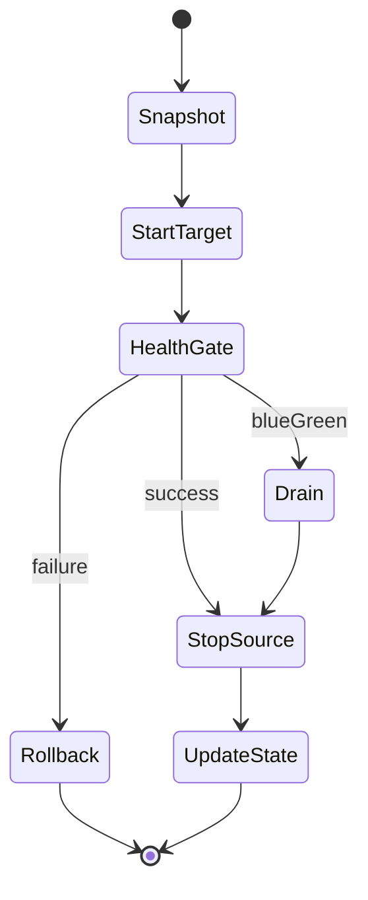

# Migration Internals

> How Aether migrates workloads between runtimes — state machine, rollback, and honest limits.

See also: [Migration Guide](MIGRATION-GUIDE.md) · [Stateful Portability](STATEFUL-PORTABILITY.md)

---

## Overview

The migration engine (`src/migration.rs`) executes a **plan** for a named workload:

1. Load workload state and spec
2. Build/run on target runtime
3. Health validation (strategy-dependent)
4. Stop/remove source (strategy-dependent)
5. Update persistent state — or **rollback** on failure

Supported strategies: **Immediate**, **Blue-Green** (default), **Rolling**, **Canary**.

---

## State machine



| Phase | Immediate | Blue-Green | Rolling |
|-------|-----------|------------|---------|
| Pre-migrate snapshot | Yes (best-effort) | Yes | Yes |
| Start target | After stop source | While source runs | Incremental |
| Health gate | After deploy | Before cutover | Per step |
| Connection drain | N/A | Up to **30s cap** | Per step |
| Stop source | First step | After green healthy | Gradual |
| Rollback | Optional restart on source | Cleanup failed green | Step rollback |

---

## Trace mode

Debug migration phases on stderr:

```bash
aether migrate my-app kubernetes --strategy blue-green --verbose-trace
# or
AETHER_MIGRATION_TRACE=1 aether migrate my-app kubernetes
```

Phases logged: `start`, `strategy`, `stop-source`, `build-target`, `start-target`, `health-gate`, `drain`, `update-state`.

---

## Limits matrix

| Concern | Status | Notes |
|---------|--------|-------|
| Workload state (name, runtime, instance ID) | **Supported** | Updated atomically in `~/.aether/state.json` or Postgres (HA) |
| Application container image | **Supported** | Rebuilt for target runtime adapter |
| Health validation | **Supported** | Exponential backoff; configurable delay |
| Rollback on deploy failure | **Supported** | Immediate strategy; optional `--no-rollback` |
| Blue-green drain | **Partial** | Capped at 30s; K8s Service label-based cutover |
| Persistent volumes / disk data | **Not supported** | Operator must replicate or restore separately |
| IP addresses | **Not supported** | New instance gets new addresses |
| DNS / external names | **Manual** | Update Ingress, Service, or external DNS |
| Secrets in spec | **Partial** | Same encrypted store; runtime-specific mounting differs |
| ConfigMaps / env | **Partial** | Translated per adapter; verify after migrate |
| GPU device assignment | **Manual** | KubeVirt/Metal3 paths need operator validation |
| StatefulSet ordering | **Not supported** | Treat as operational concern |

---

## Strategy details

### Immediate

Stop source → build → run target → health check → update state. Fastest downtime window; best for dev/staging.

### Blue-Green

Deploy green while blue runs → health gate → drain (max 30s) → stop/delete blue → update state. Production default.

### Rolling

Incremental replica shifts with health retries between steps. Suitable for scaled K8s workloads.

### Canary

Partial traffic to target (requires canary config). See migration advisor for timing suggestions.

---

## Buyer FAQ (10 questions)

1. **Does migration copy my database?** No — use dump/restore or replication. See [Stateful Portability](STATEFUL-PORTABILITY.md).
2. **Is it zero-downtime?** Blue-green/rolling minimize downtime; immediate has a stop window.
3. **What if target deploy fails?** Rollback restarts on source (when enabled).
4. **Can I migrate Podman → K8s?** Yes — all 16 runtime pairs except same-runtime.
5. **Are IPs preserved?** No.
6. **Does it work with Ingress?** Spec is re-applied on target; DNS cutover is manual.
7. **How long is drain?** `min(validation_delay, 30s)`.
8. **Can I skip health checks?** `--no-validation` reduces delay (not recommended in prod).
9. **Is there an audit trail?** Yes — migration events in audit log and API events stream.
10. **Where is state stored?** Local JSON or Postgres when HA Helm chart is used.

---

## Code references

- Engine: `src/migration.rs`
- CLI: `aether migrate` in `src/commands.rs`
- API: `POST /api/workloads/:name/migrate`
- Metrics: `aether_migration_*` Prometheus counters
