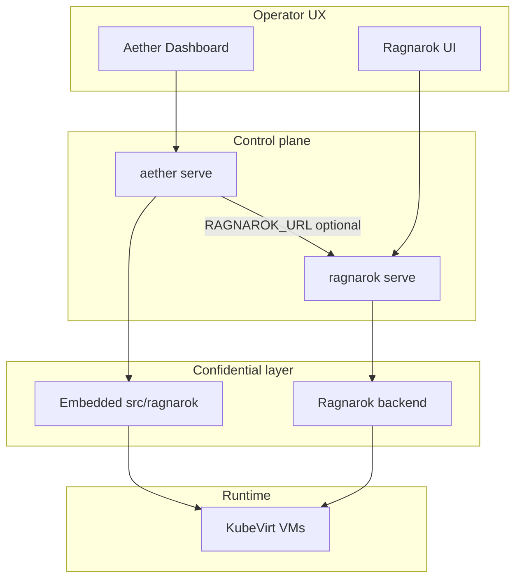

# Ragnarok and Aether — why two binaries, how they connect

Aether ships confidential computing APIs and KubeVirt manifest wiring **in-process** (`src/ragnarok/`). **Ragnarok** is a separate product binary with its own VM lifecycle UI and attestation services. Both can run alone or together in a **composite** customer bundle.

---

## What was “not wired”

Before dashboard work, Aether already exposed confidential REST endpoints under `/api/confidential/*` (attestation, trust scores, measured images, migration plans). The **web dashboard did not call them** — no nav item, no workload trust tab, no spec editor fields for `confidential:`.

Backend integration (`RAGNAROK_URL` client, deploy attestation gate, KubeVirt `launchSecurity`) was present; **UX was the missing layer**.

The dashboard now includes:

- **Confidential Computing** page (`/confidential`) — fleet trust, TEE capabilities, sovereign mode, measured images
- **Trust** tab on KubeVirt workload detail — per-workload attestation and trust score
- **Attest-gated secrets** — pending/released/revoked status on Trust tab; auto-release on attestation pass (Phase 2)
- **Visual Editor** — optional `confidential:` block when runtime is KubeVirt

---

## Why Ragnarok is a standalone binary

Per [CLIENT_BUNDLE_POLICY.md](../../CLIENT_BUNDLE_POLICY.md), customer tarballs ship **artifacts only** (no source tree):

| Product | Type | Ships |
|---------|------|--------|
| **Aether** | Native binary A | `aether` + embedded dashboard |
| **Ragnarok** | Native binary A | `ragnarok` + `frontend/dist` |

Reasons for separation:

1. **Different primary jobs** — Aether is the universal control plane (Podman, Kubernetes, KubeVirt, Metal3, migration, intent placement). Ragnarok focuses on **confidential VM operations** on KubeVirt (create wizard, attestation UX, image signing, cluster TEE inventory).
2. **Independent release and sizing** — Security teams can deploy Ragnarok on attestation-heavy nodes without pulling the full Aether surface area; dev clusters can run Aether alone with embedded confidential APIs.
3. **Composite packaging** — Enterprise bundles install both binaries side-by-side; they coordinate via env vars and shared data dirs, not a monolithic fork.

This is intentional product architecture, not an unfinished merge.

---

## Architecture



---

### Composite (enterprise)

Set on the Aether host:

```bash
export RAGNAROK_URL=https://ragnarok.internal:8443
# Optional: share attestation/image state
export RAGNAROK_DATA_DIR=/var/lib/ragnarok
```

- Aether **delegates** remote attestation verify/status to Ragnarok when `RAGNAROK_URL` is set (`src/ragnarok/client.rs`).
- Deploy path can **gate** confidential workloads on attestation (`attestation_gate_for_workload`).
- Aether dashboard shows **composite** mode on the Confidential page and links operators to the Ragnarok UI for VM-centric flows (create VM wizard, live attestation badges).

Both binaries use the same **`confidential:`** block in Aether workload YAML (`src/spec.rs`).

Example:

```yaml
runtime:
  preferred: kubevirt
  allow: [kubevirt]

confidential:
  enabled: true
  tee: sev-snp
  attestation:
    required: true
    policy: strict
  isolation:
    vtpm: true
    encryptedState: true
    debugAllowed: false
```

See `examples/confidential-snp.yaml`.

---

## When to use which UI

| Task | Use |
|------|-----|
| Deploy/migrate workload from YAML, multi-runtime placement | Aether dashboard / CLI |
| Fleet trust score, attestation explain, policy on existing Aether workloads | Aether → **Confidential** or workload **Trust** tab |
| Create confidential VM, cluster TEE node map, image sign workflow | Ragnarok UI / `rgn confidential` CLI |
| GitOps + intent scoring + confidential KubeVirt | Aether spec + optional Ragnarok for attestation ops |

---

## Environment reference

| Variable | Set on | Purpose |
|----------|--------|---------|
| `RAGNAROK_URL` | Aether | Remote Ragnarok API base for composite attestation |
| `RAGNAROK_DATA_DIR` | Both | Shared attestation/image catalog state (optional) |
| `RAGNAROK_OFFLINE_ATTESTATION` | Both | Sovereign / air-gapped attestation mode |
| `RAGNAROK_REGION_LOCK` | Both | Sovereign region enforcement |
| `VAULT_ADDR` / `VAULT_TOKEN` | Both | HashiCorp Vault KV v2 fetch for attest-gated secret release |
| `VAULT_SECRET_PATH` | Both | Vault path prefix (default `aether/{secret}` or `ragnarok/{secret}`) |
| `KBS_URL` | Both | CoCo Key Broker Service base URL |
| `AETHER_TEE_SNP` | Aether host | Advertise SEV-SNP capability when `/dev/sev` absent in dev |

---

## Related docs

- [Ecosystem overview](../../ECOSYSTEM.md)
- [Client bundle policy](../../CLIENT_BUNDLE_POLICY.md)
- Ragnarok repo: `docs/CONFIDENTIAL.md` (VM-centric confidential computing guide)
